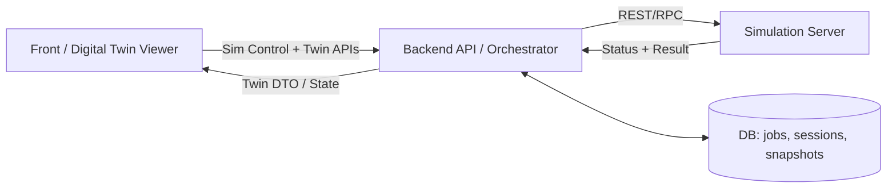

+++
title = "Digital Twin Simulation Streaming Relay Server"
date = 2026-05-02T00:00:00+09:00
type = "Web"
period = "2025.03 - 2025.06"
org = "Digital Twin Platform (Project)"
subtitle = "Digital Twin Platform | 2025.03 - 2025.06"
description = "Built a relay server to ingest, store, validate, and deliver large-scale simulation time-series data via streaming/replay for multiple users."
index = 1
visual_text = ""
visual_image = [
  "/images/projects/tmsdtn/en/tmsdtn-architecture.svg",
  "/images/projects/tmsdtn/en/tmsdtn-sequence.svg",
]

tasks = [
  { title = "Eliminated drops", desc = "Replaced WebSocket-based ingest with a Kafka queue to absorb producer/consumer skew and reduced data loss to ~0%." },
  { title = "Integrity + memory reduction", desc = "Agreed on a 9,000-chunk transmission contract to detect missing indices and cut peak memory usage by ~90% via streaming writes." },
  { title = "Storage & delivery optimization", desc = "Serialized data to binary and compressed in chunks (up to 7GB → ~700MB), and removed client sync errors with an explicit handshake." },
]
stack = ["Go", "Gin", "Kafka", "WebSocket", "chunked compression (tar.gz)", "serialization & integrity checks"]
tags = ["project", "digital-twin", "traffic", "backend", "simulation"]
+++

## Goal

Build a reliable **digital twin service** that controls and visualizes a traffic simulation derived from **real-world traffic data**. The backend sits between the **simulation server** and the **front-end viewer**, providing a stable API contract and twin-ready data.

## What I built

- **Backend orchestrator layer** between front-end and simulation server:
  - Front-end uses a single domain API surface, without directly depending on simulation-specific protocols or schemas.
- **Simulation control APIs** (domainized):
  - Create/run/stop simulation jobs, query status/progress, and fetch results.
  - Normalize simulation server responses into stable client contracts (success/failure/progress).
- **Twin data delivery**:
  - Collect simulation outputs and expose **digital-twin entities/events** (e.g., road network elements, vehicles, signals, incidents).
  - Transform raw outputs into **viewer-ready DTOs** (unit/coordinate normalization, field selection, ordering/filtering).
- **Long-running job management**:
  - Manage job lifecycle as `queued → running → (failed|completed)`.
  - Provide consistent state queries; support safe cancellation/stop flows where the simulation server allows it.
- **Reliability & error handling**:
  - Timeout handling, conditional retries, idempotency/deduplication, and error mapping to user-facing codes/messages.

## Architecture (concept)

## Key challenge (contract & change management)

Simulation servers tend to evolve quickly (parameter changes, schema additions, new error modes). The main challenge was keeping the front-end productive by:

- absorbing simulation-side changes in the backend,
- stabilizing the API contract via DTO/schema normalization,
- and making error/status handling predictable for long-running workloads.

## Validation (non-numeric)

Post-release stability was ensured through scenario-based integration checks (happy path + failure modes such as timeouts, invalid parameters, and partial results). Quantitative KPIs are not disclosed/available after leaving the company.

## Why it matters

By centralizing simulation control and twin-data transformation in the backend, the front-end can focus on visualization/UX while the simulation team can evolve their implementation without breaking client integrations.
