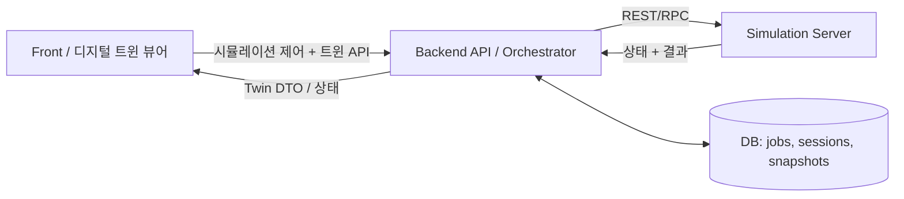

+++
title = "디지털 트윈 시뮬레이션 데이터 스트리밍 중계 서버"
date = 2026-05-02T00:00:00+09:00
type = "Web"
period = "2025.03 - 2025.06"
org = "Traffic Digital Twin (Project)"
subtitle = "Traffic Digital Twin | 2025.03 - 2025.06"
description = "대용량 시뮬레이션 시계열 데이터를 안정적으로 수집·저장·검증하고, 다중 사용자에게 스트리밍/리플레이로 제공하는 중계 서버를 개발했습니다."
index = 1
visual_text = ""
visual_image = [
  "/images/projects/tmsdtn/ko/tmsdtn-architecture.svg",
  "/images/projects/tmsdtn/ko/tmsdtn-sequence.svg",
]

tasks = [
  { title = "병목/유실 제거", desc = "WebSocket 기반 수신을 Kafka 큐로 전환해 생산·소비 속도 차이를 완충하고, 데이터 유실률 0% 수준으로 안정화했습니다." },
  { title = "무결성 검증 + 메모리 절감", desc = "전송 규격을 9000 청크로 합의해 누락 인덱스를 검출하고, 수신 즉시 저장/정리로 메모리 피크를 90% 절감했습니다." },
  { title = "저장/전달 최적화", desc = "데이터를 바이너리로 직렬화하고 청크 단위 압축으로 저장 용량을 최대 7GB → 700MB 수준으로 절감, 클라이언트 핸드셰이크로 싱크 오류를 제거했습니다." },
]
stack = ["Go", "Gin", "Kafka", "WebSocket", "파일 압축(tar.gz)", "직렬화/무결성 검증"]
tags = ["project", "digital-twin", "traffic", "backend", "simulation"]
+++

## 목표

실제 도로에서 수집된 교통 데이터 분석 결과를 바탕으로 생성되는 **교통 시뮬레이션**을 제어하고, 그 결과를 **디지털 트윈(시각화/제어)** 형태로 제공하는 서비스를 구축했습니다. 백엔드는 **시뮬레이션 서버**와 **프론트(트윈 뷰어)** 사이에서 안정적인 API 계약과 트윈 표출용 데이터를 제공합니다.

## 어필 포인트(서류/면접 핵심)

- **비동기 오케스트레이션**: REST 요청을 받아 메시징 기반 워크플로우로 시뮬레이션 분석 작업을 트리거하고(UUID 추적 + 상태 라이프사이클) 안정적으로 관리.
- **트윈 KPI API 제공**: LOS/제어지체, 교통량, 탄소 등 시뮬레이션 결과를 DB 조회 + DTO 가공으로 프론트가 바로 쓰는 계약으로 제공.
- **파일 아티팩트 구조화**: 시뮬레이션/트윈 결과를 파일 스냅샷으로 구조화(보관/복원/압축)해 재현 가능성과 전달 안정성 확보.
- **WebSocket 스트리밍**: 동시 세션을 고려해 포트 풀/세션 단위로 WebSocket 스트리밍을 제공, 트윈 뷰어의 준실시간 UX 지원.
- **운영 안정성**: 타임아웃/오류 매핑/정책 기반 정리(클린업) 등 운영 관점의 안정화 로직 반영.

## 구현 내용

- **백엔드 오케스트레이터 레이어** 구축:
  - 프론트는 시뮬레이션 내부 규격/프로토콜을 몰라도 단일 도메인 API로 제어/조회 가능
- **시뮬레이션 제어 API 도메인화**
  - 시뮬레이션 생성/실행/중지, 상태/진행 조회, 결과 조회
  - 시뮬레이션 서버 응답을 성공/실패/진행 상태로 **정규화**하여 제공
- **디지털 트윈 데이터(엔티티/이벤트) 제공**
  - 시뮬레이션 결과로부터 트윈 구성 요소(예: 도로/차량/신호/이벤트/사고 등) 수집
  - 좌표/단위 정리, 필요한 필드 선별, 정렬/필터링 등 **뷰어 친화 DTO**로 가공
- **롱런 작업 상태 관리**
  - `queued → running → (failed|completed)` 상태 흐름으로 작업 라이프사이클 관리
  - 상태 조회를 일관된 형태로 제공하고, 시뮬레이터 지원 범위 내에서 취소/중지 플로우 구현
- **신뢰성/예외 처리**
  - 타임아웃, 조건부 재시도, 멱등성/중복 요청 방지, 오류 매핑(코드/메시지) 등 연동 안정화
- **파일 아티팩트/스트리밍**
  - 시뮬레이션 결과를 파일 아티팩트로 저장하고, 스냅샷/복원 및 압축을 통해 전달/재생(리플레이) 가능한 구조로 구성
  - 트윈 데이터는 WebSocket으로 스트리밍하여 뷰어의 준실시간 표출을 지원

## 아키텍처(개념)

## 핵심 과제(계약/변경 관리)

시뮬레이션 서버는 파라미터/스키마/오류 케이스가 빠르게 변하는 편이라, 프론트 생산성을 유지하는 것이 핵심 과제였습니다.

- 시뮬레이션 측 변경을 백엔드에서 흡수
- DTO/스키마 정규화를 통해 API 계약을 안정화
- 롱런 작업에서 예외/상태 처리를 예측 가능하게 표준화

## 검증(정량 미공개)

해피패스와 실패 케이스(타임아웃, 잘못된 파라미터, 부분 결과 등) 중심의 시나리오 기반 연동 검증으로 안정성을 확보했습니다. 퇴사 후 정량 지표에는 접근이 불가하여 수치는 기재하지 않았습니다.

## 의미

시뮬레이션 제어와 트윈 데이터 가공을 백엔드에 집중시켜, 프론트는 시각화/UX에 집중할 수 있었고 시뮬레이션 팀은 내부 구현을 개선해도 클라이언트 연동이 깨지지 않도록 구조를 만들었습니다.
